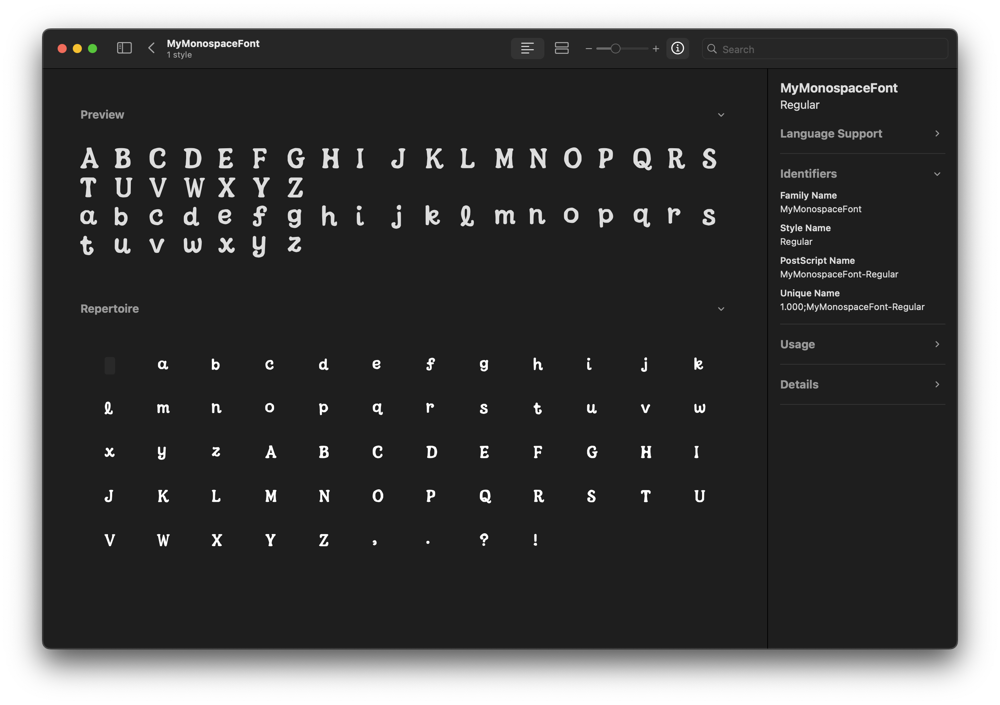
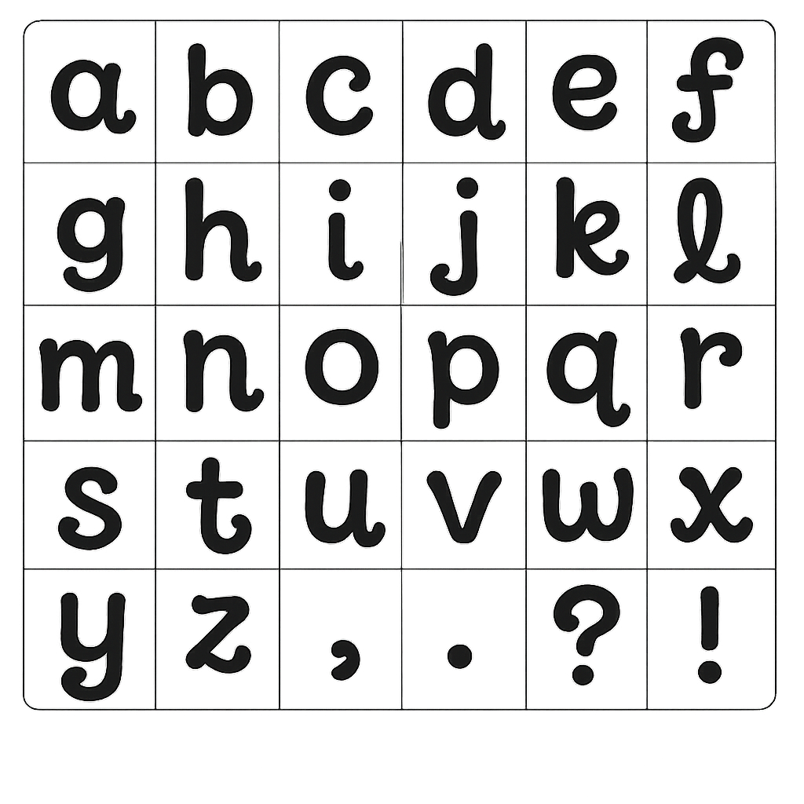
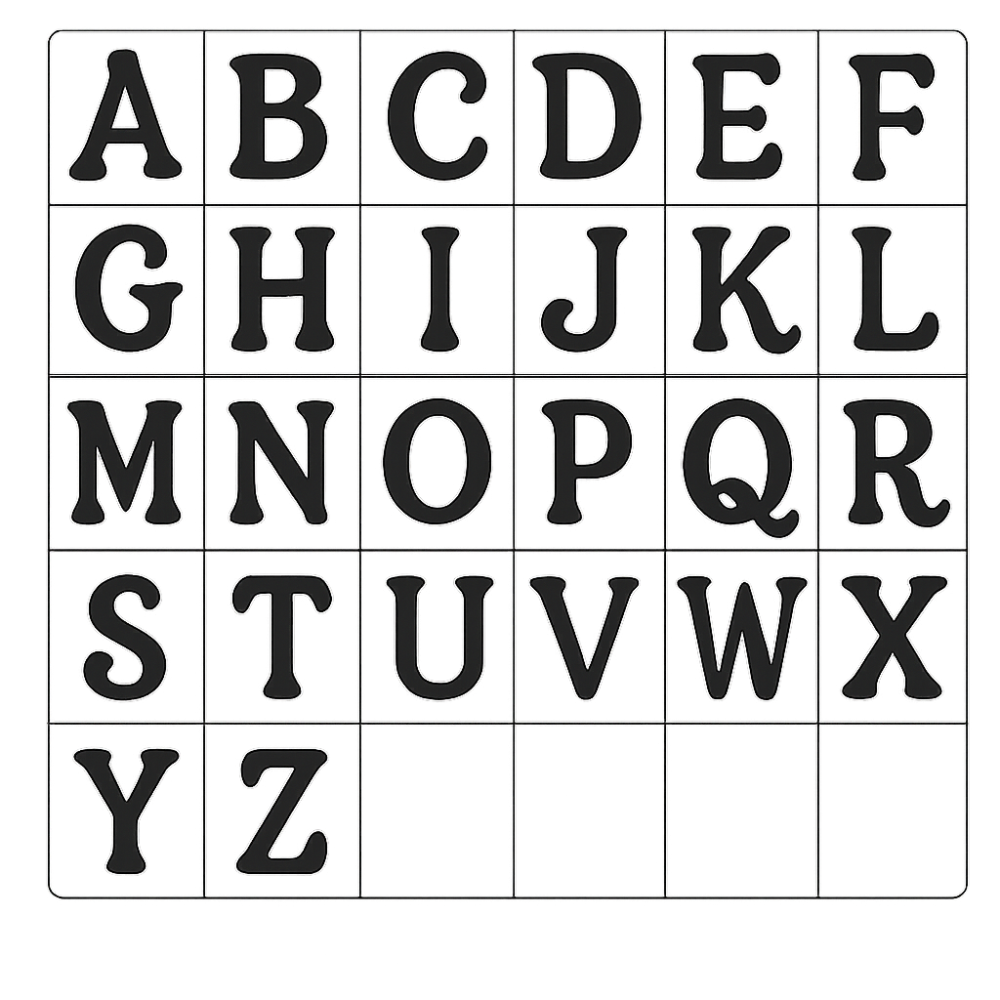

# Generate Font with AI like GPT-4o

[](https://barbiefont.fun)

Generate your own custom TrueType Fonts (`.ttf`) inspired by playful, rounded aesthetics (like the "Barbie" style)! This project provides a Python-based workflow that takes you from AI-generated (e.g., GPT-4o) PNG grids of characters, through vectorization with `pypotrace`, to a final, usable font file assembled using `fontTools`.

## Workflow Overview

The core workflow involves these steps, automated by the provided Python scripts:

1.  **Generate Source PNG Grids:** Create glyph grids using gpt-4o, with each character in one cell.
2.  **Split Grid PNGs:** Use `split_glyphs.py` to automatically crop the grid image into individual PNG files, one for each character cell. *(Manual renaming of output files is likely required).*
3.  **Convert PNGs to SVGs:** Use `convert_to_svg.py` to vectorize the individual character PNGs. This script employs `pypotrace` and critically generates SVGs using a **consistent `viewBox` based on the full source PNG dimensions**, providing a stable reference frame for alignment.
4.  **Generate TTF Font:** Use `generate_font.py` to compile the SVGs into the final `.ttf` font file. This script uses `fontTools` to:
    * Parse SVG path data.
    * Apply transformations that scale glyphs based on the full SVG canvas height and map the canvas bottom edge to the font's `descender` line, ensuring consistent baseline alignment relative to the font's coordinate system.
    * Define essential font metrics (UPM, Ascender, Descender, etc.) in standard OpenType tables (`head`, `hhea`, `OS/2`).
    * Build the character-to-glyph mapping (`cmap`).
    * Assemble and save the complete font file.

## Installation

### Prerequisites

**1. Potrace & Dependencies:**

* **macOS (using Homebrew):**
    ```bash
    # Install build dependencies
    brew install libagg potrace pkg-config
    ```
    *Build and install pypotrace (adjust paths if your Homebrew installation or libagg version differs):*
    ```bash
    AGG_VERSION="2.5_1"
    AGG_INCLUDE_PATH="/opt/homebrew/Cellar/libagg/${AGG_VERSION}/include"
    AGG_LIB_PATH="/opt/homebrew/Cellar/libagg/${AGG_VERSION}/lib"
    
    CFLAGS="-I/opt/homebrew/include -I${AGG_INCLUDE_PATH}" \
    CXXFLAGS="-I/opt/homebrew/include -I${AGG_INCLUDE_PATH}" \
    LDFLAGS="-L/opt/homebrew/lib -L${AGG_LIB_PATH}" \
    pip install pypotrace
    ```

* **Ubuntu/Debian:**
    ```bash
    # Install build dependencies
    sudo apt-get update
    sudo apt-get install libagg-dev libpotrace-dev pkg-config python3-dev
    ```
    *Install pypotrace:*
    ```bash
    pip install pypotrace
    ```

**2. Python Dependencies:**

Install the required Python libraries.

```bash
pip install -r requirements.txt
```

## Usage

### 1. Generate & Prepare Source PNG Grids

AI Generation: Use GPT-4o to generate initial glyph concepts arranged in a grid.
Example Prompt:

```
create an transparent image of glyph grid of all a-z(lowercase) and comma, period, question mark, exclamation point characters, each character in one grid. Total 5x6 grids for 26 alphabet characters and four punctuation marks. The grid border is thin. The font style should be
- Rounded Strokes: Bulky, smooth curves.
- Minimal Contrast: Uniform stroke weight .
- Swashes/Ligatures: Decorative extensions at the ends of letters (e.g., loops, curls) to mimic a playful, hand-drawn style.
```

Repeating this to get the uppercase characters.

Example output:

| Lowercase & punctuation | Uppercase |
|------------------------|-----------|
|  |  |

### 2. Split PNG Grids into Individual Glyphs

This script extracts each character cell based on the provided character string.

```bash
# Create output directory structure
mkdir -p output/characters

# Split lowercase and punctuation
# NOTE: Ensure the characters string matches the grid order EXACTLY.
python split_glyphs.py \
  --input assets/barbie-font-lowercase.png \
  --output output \
  --characters "abcdefghijklmnopqrstuvwxyz,.?!"

# Split uppercase
python split_glyphs.py \
  --input assets/barbie-font-uppercase.png \
  --output output \
  --characters "ABCDEFGHIJKLMNOPQRSTUVWXYZ"

# Saved files like 'output/characters/97_a.png', 'output/characters/comma.png', etc.
# We use <unicode_id>_<char>.png instead of <char>.png to avoid conflicts.
```

### 3. Convert Individual PNG Glyphs to SVG

Vectorize the prepared PNGs.

```bash
python convert_to_svg.py -i output/characters/

# SVGs will be saved as 'output/characters/97_a.svg', 'output/characters/65_A.svg', etc.
```

> Optional: Manual Editing: You can also edit these svgs manually in any image editor for better quality.

### 4. Generate the TTF Font File

Compile the SVGs into the final TTF font.

```bash
# Adjust parameters as needed, especially --descender for vertical alignment.
python generate_font.py \
  -i output/characters/ \
  -o MyMonospaceFont-Regular.ttf \
  --family "MyMonospaceFont" \
  --style "Regular" \
  --width 600 \
  --upm 1000 \
  --ascender 800 \
  --descender -200
# The TTF file (e.g., MyMonospaceFont-Regular.ttf) will be created.
```

## Scripts Overview

`split_glyphs.py`: Crops a grid-based PNG image into individual PNG files, one per character, based on a provided character string mapping. (Requires careful character string ordering and likely needs output renaming for mis recognition correctly).

`convert_to_svg.py`: Converts individual PNG glyph images into SVG format using pypotrace. It generates SVGs with a consistent `viewBox="0 0 img_width img_height"` based on the source PNG dimensions, establishing a reliable coordinate system for alignment.

`generate_font.py`: The main font building script using fontTools.

- Applies a specific transformation (Option 2b from development) that scales the full SVG canvas height to match the font's ascender-to-descender range and aligns the SVG canvas bottom edge with the font's descender line.
- Defines essential font metrics in OpenType tables (head, hhea, OS/2, name, post).
- Builds the character map (cmap) and glyph data (glyf, loca, hmtx, maxp).
- Saves the final `.ttf` file.

## TODO

- [ ] Optimize font quality like ensuring consistent baseline alignment across different characters.
- [ ] Character Set Expansion.
- [ ] Support exporting to woff2 for web usage.

## Preview

**See the generated font in action at [barbiefont.fun](https://barbiefont.fun)!**
